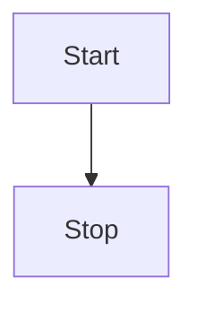

# 機能一覧

これは機能一覧のページです。

## ログイン機能

ログインは[Googleアカウント連携](https://developers.google.com/identity/sign-in/web/sign-in?hl=ja)によるログインのみとする。

::: details なぜGoogleアカウント連携によるログインのみ？
以下の点からGoogleログインAPIのみを利用することとした
- アカウント情報をDBに保存することによるセキュリティリスクの軽減
- ログインページの実装が非常に簡単
:::

## マイページ機能

マイページでは下記の情報を管理できる

- AAA
- BBB
- CCC

::: tip
CCCは現状では検討中の機能のため、実装は未定
:::

## Mermaid表示

